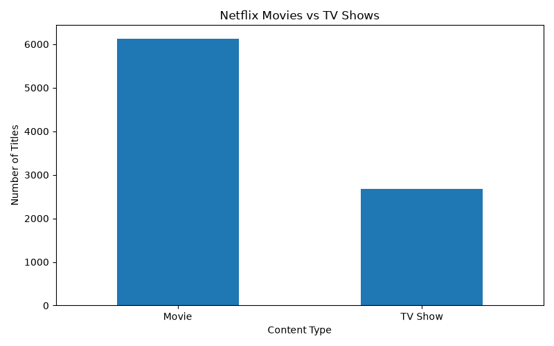
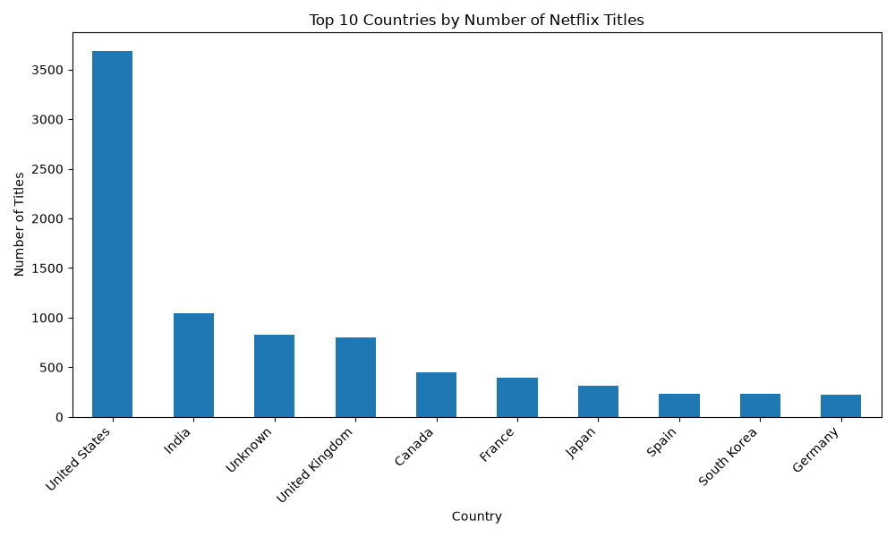
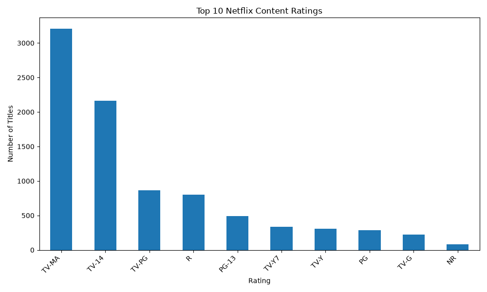

# 🎬 Netflix Data Analysis & Visualization

## 📊 Project Overview

This project focuses on analyzing the Netflix titles dataset to discover meaningful patterns and insights about the content available on Netflix.

Using Python, Pandas, and Matplotlib, the dataset was cleaned, explored, analyzed, and visualized to understand content types, countries, and content ratings.

The project demonstrates practical data analysis skills including data cleaning, exploratory data analysis (EDA), aggregation, and data visualization.

---

## 🎯 Project Objectives

- Analyze the Netflix titles dataset
- Understand the distribution of Movies and TV Shows
- Identify countries with the highest number of Netflix titles
- Analyze Netflix content ratings
- Perform data cleaning and preprocessing
- Create meaningful visualizations
- Extract useful insights from the dataset

---

## 🛠️ Tools & Technologies

- **Python**
- **Pandas**
- **Matplotlib**
- **CSV Dataset**
- **Exploratory Data Analysis (EDA)**

---

## 📂 Dataset

The project uses the **Netflix Titles Dataset**, containing information about movies and TV shows available on Netflix.

### Dataset Information

- **Total Titles:** 8,807
- **Unique Countries:** 749
- **Unique Ratings:** 18

### Important Columns

| Column | Description |
|---|---|
| `show_id` | Unique ID of the title |
| `type` | Movie or TV Show |
| `title` | Name of the title |
| `director` | Director of the title |
| `cast` | Cast members |
| `country` | Country associated with the title |
| `date_added` | Date added to Netflix |
| `release_year` | Original release year |
| `rating` | Content rating |
| `duration` | Movie duration or number of seasons |
| `listed_in` | Genres/categories |
| `description` | Title description |

---

## 🧹 Data Cleaning

The dataset was prepared before analysis.

The cleaning process included:

- Loading the CSV dataset using Pandas
- Inspecting dataset structure and information
- Checking missing values
- Processing country information
- Preparing columns for analysis
- Handling data in a format suitable for visualization

---

## 🔍 Exploratory Data Analysis

The following analysis was performed:

### 1. Movies vs TV Shows

Compared the number of Movies and TV Shows available in the dataset.

**Visualization:**

`movies_vs_tv_shows.png`

---

### 2. Top 10 Countries

Analyzed the countries associated with the highest number of Netflix titles.

**Visualization:**

`top_10_countries.png`

---

### 3. Top 10 Content Ratings

Analyzed the most common content ratings in the Netflix dataset.

**Visualization:**

`top_10_ratings.png`

---

## 📈 Visualizations

### Movies vs TV Shows



### Top 10 Countries



### Top 10 Ratings



---

## 💡 Key Insights

The analysis provides insights into:

- The distribution of Movies and TV Shows on Netflix
- Countries contributing a large number of titles
- The most common content ratings
- The overall structure and characteristics of Netflix's content library

These insights demonstrate how raw data can be transformed into meaningful information using Python-based data analysis.

---

## 📁 Project Structure

```text
Netflix Data Analysis
│
├── netflix_analysis.py
├── netflix_titles.csv
├── movies_vs_tv_shows.png
├── top_10_countries.png
├── top_10_ratings.png
└── NETFLIX_PROJECT_README.md
